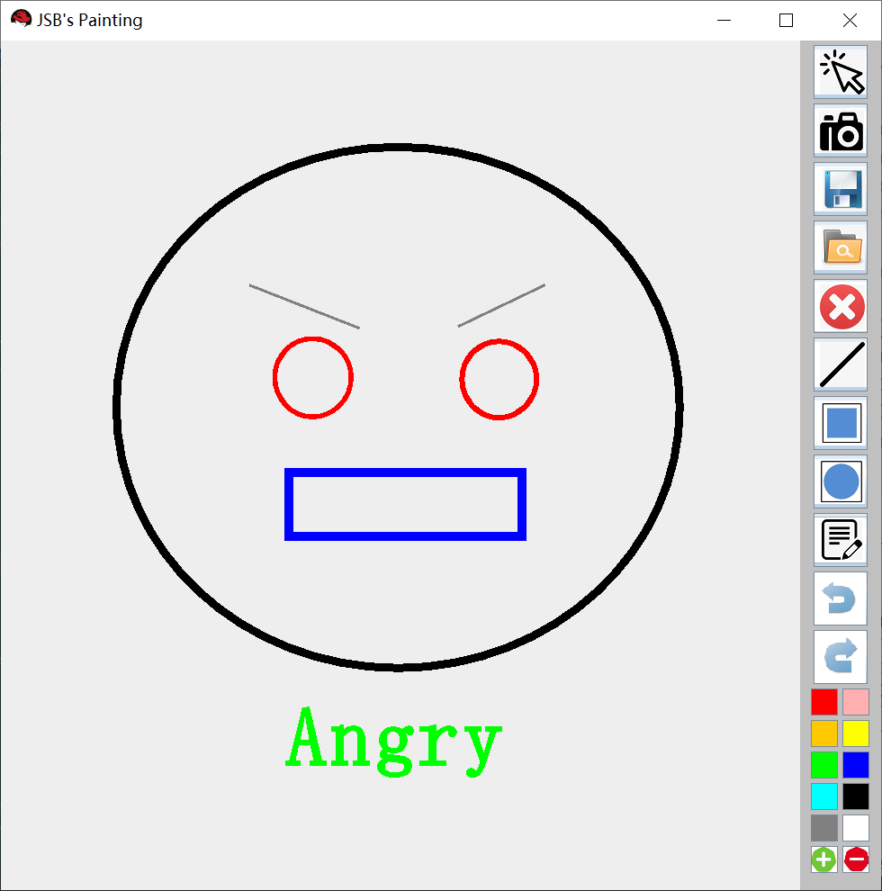
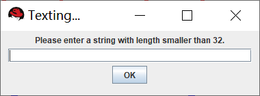

## MiniCAD
> A simple project for JAVA: mspaint

3170102587 蒋仕彪

#### 题目要求

做一个简单的绘图工具，以CAD的方式操作，能放置直线、矩形、圆和文字，能选中图形，修改参数，如颜色等，能拖动图形和调整大小，可以保存和恢复。功能请参考视频演示。
要求上传：
1. 源码；
2. 实验报告；
3. 可执行的jar文件。

演示视频下载链接: https://pan.baidu.com/s/1dFaZ2Ml 密码: d3xg

#### 功能介绍

+ 主界面如下：

	

+ 基本原理和约定
	- 所有形状都是一个对象，画完后依然可以修改它。
	- 可以按截图键将其保存为 png。如果直接导出的话，将导出所有对象的序列化文件，使得再次导入时可以重新得到所有对象。

+ 右侧工具栏介绍
	- **选中键**：按下后，可以在画布中选中图形，也可以拖动图形（改变图形）。拖动后，该图形会位于最上层。按如下要求判断哪个图形被选中：
		+ 鼠标单击时，与直线的距离 <= 3，直线被选中
		+ 鼠标单击时，在矩形的内部和边界，矩形被选中。
		+ 鼠标单击时，在椭圆的内部和边界，椭圆被选中。
		+ 如果同时有多个图形能被选中，取最上面那个。
	- **截图键**：按下后会弹出一个对话框。输入目标文件路径后，即可将当前画板输出为 png 形式的图片。
	- **保存键**：按下后会弹出一个对话框。输入目标文件路径后，即可将当前画板的所有对象 **序列化** 输出。序列化是为了方便载入（这样载入时依然满足可以操控每一个对象）。
	- **打开键**：按下后会弹出一个对话框。输入目标文件路径后，从序列化文件中读取之前保存的内容到画板。
	- **删除键**：先选中一个对象，按下删除键后可以从画图板中删除它。
	- **直线**：选中后，可以在画板上画出一条直线。可以在拖动的时候调整大小。
	- **矩形**：选中后，可以在画板上画出一个矩形。可以在拖动的时候调整大小。
	- **椭圆**：选中后，可以在画板上画出一个椭圆。可以在拖动的时候调整大小。
	- **文本框**：按下后会弹出一个对话框，输入文本后即可在画板上显示文本信息。
	- **撤销**：撤销最近的一次**画图**操作。需要注意的是：
		+ 撤销的只是目前画板最上层的对象；删除一个对象后是无法撤销的。
		+ 如果通过鼠标单击拖动某图形，它会位于最高层，撤销时会先撤销它。
	- **重做**：重做最近的一次**画图**操作，与撤销相对。

+ 绘制案例（该案例通过截图功能保存）
	

#### 技术细节

+ 总体框架
	- 全局有一个继承自 `JFrame` 的 `Draw`，总来搭建总体的 Windows 框架。它是一个 `BoarderLayOut` 的布局，其中左侧是画板 `board`，右侧是工具栏。代码如下：
		~~~ JAVA
    	super("JSB's Painting");
        this.setSize(WIDTH, HEIGHT);
        this.setDefaultCloseOperation(JFrame.EXIT_ON_CLOSE);
        this.setLocationRelativeTo(null);

        this.setLayout(new BorderLayout());

        myMouse = new DrawListener();
        this.addMouseListener(myMouse);
        this.addMouseMotionListener(myMouse);

        JPanel board = new JPanel();
        JPanel toolBar = new JPanel();
        this.add(board, BorderLayout.CENTER);
        this.add(toolBar, BorderLayout.EAST);

        toolBar.setPreferredSize(new Dimension(COLORWIDTH * 3, HEIGHT));
        toolBar.setBackground(Color.LIGHT_GRAY);

        String[] shapeName = { "Choose", "Camera", "Save", "Open", "Delete", "Line", "Rectangle", "Oval", "Text", "Undo", "Redo" };
        for (int i = 0; i < shapeName.length; i++) {
            JButton nowButton = new JButton(shapeName[i]);
            nowButton.setIcon(new ImageIcon("src/images/" + shapeName[i] + ".png"));
            nowButton.setPreferredSize(new Dimension(ICONWIDTH, ICONWIDTH));
            nowButton.addActionListener(myMouse);
            toolBar.add(nowButton);
        }

        Color[] colorArray = {Color.red, Color.pink, Color.orange, Color.yellow, Color.green, Color.blue, Color.cyan,
                Color.black, Color.gray, Color.white};
        for (int i = 0; i < colorArray.length; i++) {
            JButton nowButton = new JButton();
            nowButton.setBackground(colorArray[i]);
            nowButton.setPreferredSize(new Dimension(COLORWIDTH , COLORWIDTH));
            nowButton.addActionListener(myMouse);
            toolBar.add(nowButton);
        }
    	~~~
	- 再开一个 class 叫做 `DrawListener`，实现 `MouseListener, MouseMotionListener, ActionListener` 的接口，用来监听鼠标操作和按键操作。需要 `Override` 所有相关函数，是本实验的核心。

+ 对象的表示
	- 设置一个抽象类 `Shape`，用来描述一个图形。
		~~~JAVA
        public abstract class Shape implements Serializable {
            protected int cx, cy;
            protected Color color;
            protected float size;
            protected String name;
            public String getName(){return name;}
            public Shape(String name, int cx, int cy, Color color){
                this.name = name;
                this.cx = cx;
                this.cy = cy;
                this.color = color;
                size = 3.0f;
            }
            public void move(int deltax, int deltay){
                cx += deltax;
                cy += deltay;
            }
            public float getSize(){return size;}
            public void setSize(float size){
                this.size = Math.min(10.0f, size);
                this.size = Math.max(1.0f, this.size);
            }
            public void setColor(Color color){
                this.color = color;
            }
            public abstract void draw(Graphics g);
            public abstract boolean in(int curX, int curY);
        }
        ~~~
		+ `(cx, cy)` 表示左上角坐标信息，`color` 表示颜色信息，name表示继承类的名字，size 表示大小（粗细）。
		+ 有两个虚函数 `draw` 和 `in`，分别表示 绘制该图形 和 判断鼠标是否点击该图形。
	- 再开四个类 `Line, Rectangle, Oval, Text`，均继承自 `Shape` 类，会有一些额外的参数用来描述图形。拿 `Line` 类举例：
		~~~Java
        public class Line extends Shape implements Serializable {
            private int dx, dy;
            @Override
            public void move(int deltax, int deltay){
                super.move(deltax, deltay);
                dx += deltax; dy += deltay;
            }
            public Line(String name, int cx, int cy, int dx, int dy, Color color){
                super(name, cx, cy, color);
                this.dx = dx;
                this.dy = dy;
            }
            public boolean in(int x, int y){
                int px = x - cx, py = y - cy;
                int qx = dx - cx, qy = dy - cy;
                int S = Math.abs(px * qy - qx * py);
                double d = S / Math.sqrt(qx * qx + qy * qy);
                return d <= 3.0;
            }
            public void draw(Graphics g){
                g.setColor(color);
                ((Graphics2D)g).setStroke(new BasicStroke(size));
                g.drawLine(cx, cy, dx, dy);
                ((Graphics2D)g).setStroke(new BasicStroke(1.0f));
            }
        }
        ~~~
        直线选中的判定是：鼠标点击处到直线的距离 `<= 3`.
+ 存储和删除逻辑
	- 全局开一个 `Stack<Shape>DoList` 用来存储所有已绘制的图形。
	- 删除时，直接在 `Dolist` 里用 `remove` 函数删掉对应的对象。所以说，删除操作不支持撤销。
	- 再开一个 `Stack<Shape>TodoList` 用来恢复绘图。具体地，每次撤销时，将 `DoList` 栈顶元素弹出，压入 `TodoList` 里。每次重做时，重复相反过程。
	- 每当撤销绘制后，我们很难从当前图层返回上一层图层。于是我实现的方法是，设置重绘函数 `paint()`，**每当进行完撤销操作后就清空画布并重绘整个 `Dolist`**。
	- 朴素实现绘图板时，如果对画板实行放大缩小操作，画布会自动清空。**如果想要随着画布变化图形依然不变，必须复写 JFrame 的 `paint()` 函数**。如图：
		~~~Java
        public void paint(Graphics g){
            super.paint(g);
            this.getContentPane().setBackground(Color.white);
            myMouse.paint();
        }
        ~~~
        其中 `myMouse.paint()` 就是遍历整个 `DoList` 绘制。

+ 对话框设计
	- 在进行截图、保存、打开和文本输入时，我们需要从用户处得到字符串。
	- 每次这几个按钮按下时，会触发统一风格的新窗口，如下：
		~~~Java
        void buildFrame(String frameName, String labelName){
            JLabel label = new JLabel(labelName);
            content = new JTextField(32);
            fileFrame = new JFrame(frameName);
            Container contentPane = fileFrame.getContentPane();
            contentPane.setLayout(new FlowLayout());
            contentPane.add(label);
            contentPane.add(content);
            contentPane.add(OKbutton);
            fileFrame.setSize(400, 150);
            fileFrame.setLocationRelativeTo(null);
            fileFrame.setVisible(true);
        }
        ~~~
     - 效果如下：
        

+ 鼠标拖动时的逻辑
	- 如果当前按下了选中键，鼠标拖动时需要改变选中对象的位置。
	- 如果当前按下了绘制图形的按键，鼠标拖动时我们要**实时显示图形的当前大小**，方便用户判断什么时候应该松开按键。注意，此处每次绘制时不能新建图像，应该直接修改栈顶的图形。
	~~~Java
    @Override
    public void mouseDragged(MouseEvent e) {
        int edX = e.getX(), edY = e.getY();
        int x1 = Math.min(stX, edX), x2 = Math.max(stX, edX);
        int y1 = Math.min(stY, edY), y2 = Math.max(stY, edY);

        if (nowSelect.equals("Choose")) {
            if (nowShape != null) {
                nowShape.move(edX - curX, edY - curY);
                DoList.remove(nowShape);
                DoList.push(nowShape);
                myFrame.paint(myGraph);
            }
        }
        else if (nowSelect.equals("Line") || nowSelect.equals("Rectangle") || nowSelect.equals("Oval")){
            if (Dragging) {
                if (!DoList.isEmpty())
                    DoList.pop();
            }
            else {
                Dragging = true;
            }
            if (nowSelect.equals("Line"))
                nowShape = DoList.push(new Line("Line", stX, stY, edX, edY, nowColor));
            else if (nowSelect.equals("Rectangle"))
                nowShape = DoList.push(new Rectangle("Rectangle", x1, y1, x2-x1, y2-y1, nowColor));
            else if (nowSelect.equals("Oval")){
                nowShape = DoList.push(new Oval("Oval", x1, y1, x2-x1, y2-y1, nowColor));
            }
            myFrame.paint(myGraph);
        }
        curX = edX; curY = edY;
    }
    ~~~

+ 截图，保存和打开功能的实现
	- 代码如下：
	~~~Java
    switch (operation){
       case Saving:
           ObjectOutputStream oos;
           try {
               oos = new ObjectOutputStream(new FileOutputStream(content.getText()));
               oos.writeObject(DoList);
           }
           catch (IOException ie){
           }
           break;
       case Opening:
           ObjectInputStream ios;
           try {
               ios = new ObjectInputStream(new FileInputStream(content.getText()));
               Object obj = ios.readObject();
               DoList = (Stack<Shape>)obj;
               myFrame.paint(myGraph);
           }
           catch (Exception ie){
               System.out.println(ie.getMessage());
           }
           break;
       case Screening:
           try{
               ImageIO.write(bi, "PNG", new File(content.getText()));
           }
           catch (IOException ie){
               System.out.println(ie.getMessage());
           }
   }
    ~~~
	- 保存时需要将 `DoList` 对象序列化。定义一个 `ObjectOutputStream`，并获取用户指定的保存路径，调用 `writeObject` 即可序列化。注意要 `catch` IO异常。
	- 打开时需要反序列化。定义一个 `ObjectInputStream`，从用户指定的路径读入。读入时用 `readObject` 读入一个 `Object` 对象，并将其强转成 `Stack<Shape>`。
	- 假设图像 bi 已经记录了当前画布，我们只需用 Image.IO.write 导出图片即可。那么如何将我们的画布 `Graphics2D` 放进 `BufferedImage` 里呢？注意到，每个  `BufferedImage` 都有独立的 `Graphics`，可以通过 `getGraphics（）` 函数得到。**但是我们画图时用的 `Graphics` 是 `JFrame` 的**（两者不是同一个），而深拷贝的操作很难实现。所以我采用的方法是，用 `DoList` 把 `BufferedImage` 的 `Graphics` 重新画一遍并保存。
		~~~Java
        	if (nowSelect.equals("Camera")){
               operation = Operation.Screening;
               buildFrame("Screening...", "Please enter your saving path.");
               bi = new BufferedImage(WIDTH, HEIGHT, BufferedImage.TYPE_INT_ARGB);
               Graphics biGraph = bi.getGraphics();
               for (Shape sh: DoList)
                   sh.draw(biGraph);
               biGraph.dispose();
               nowSelect = "Choose";
           }
        ~~~

	